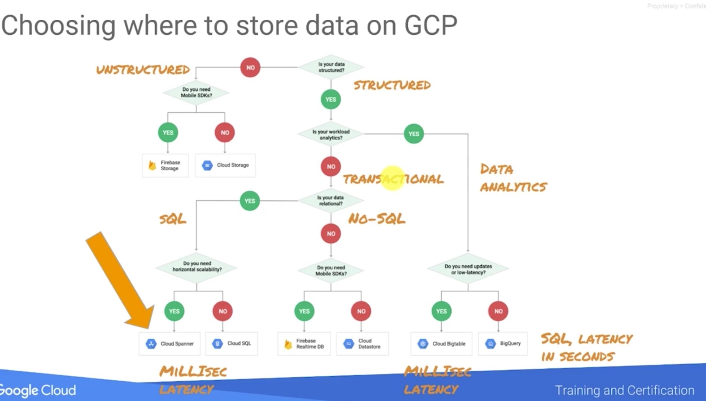

Data Engineering on Google Cloud Platform Specialization
=======================================================
There are 5 courses here:
1. GCP BD & ML Fundamentals
2. Leveraging Unstructured Data with Cloud Dataproc on GCP
3. Serverless Data Analysis with Google BigQuery and Cloud Dataflow
4. Serverless ML with Tensorflow on GCP
5. Building Resilient Streaming Systems on GCP


Course 1 - Google Cloud Platform Big Data and Machine Learning Fundamentals
===========================================================================

Keys
===

- Read the details here in **https://cloud.google.com/solutions/**
- Security: **https://cloud.google.com/security/**

Datastore
---
- Cloud Datastore: NoSQL, is not a relational database, and it is not an effective storage solution for analytic data

Misc
====
- Pricing Calculator
- Cloud Launcher
  - deploy the pre-installed things

History
=======
- 2008, Google lanuched App Engine
- Now, Google Container Engine

Advantages:
-----------
- Cost effective
- Reliable
- Auto-scaling

Service:
-------
- DATAPROC: fully-managed cloud service for running Apache Spark and Apache Hadoop clusters in a simpler, more cost-efficient way
- Cloud SQL: for not so large data (GB)

Labs I've gone through
=====================

Create ML Dataset with BigQuery
--------

- Use BigQuery and Datalab to explore and visualize data
- Build a Pandas dataframe that will be used as the training dataset for machine learning using TensorFlow

### Launch Cloud Datalab
In Cloud Shell, type:

```gcloud compute zones list```
Pick a zone in a geographically closeby region.

In Cloud Shell, type:

```datalab create bdmlvm --zone <ZONE>```


Lab Exercises
===

Course 2 - Dataproc, Leveraging Unstructured Data with Cloud Dataproc on Google Cloud Platform
===================

### Lab 1: Create a Dataproc Cluster

- Prepare a bucket for cluster initialization
- Create a Dataproc Hadoop Cluster customized to use the Google Cloud API
- Enable secure access to the Dataproc cluster
- Explore Hadoop operations

- Create the source file for setting and resetting environment variables

- ports 8088 (Hadoop Job Interface) and 9870 (Hadoop Admin interface)


Course 3 - BigQuery & Dataflow, Serverless Data Analysis with Google BigQuery and Cloud Dataflow
===================

- SQL example
```sql
WITH
  commits AS (
  SELECT
    author.email,
    LOWER(REGEXP_EXTRACT(diff.new_path, r'\.([^\./\(~_ \- #]*)$')) lang,
    diff.new_path AS path,
    author.date
  FROM
    `bigquery-public-data.github_repos.commits`,
    UNNEST(difference) diff
  WHERE
    EXTRACT(YEAR
    FROM
      author.date)=2016 )
SELECT
  lang,
  COUNT(path) AS numcommits
FROM
  commits
WHERE
  LENGTH(lang)<8
  AND lang IS NOT NULL
  AND REGEXP_CONTAINS(lang, '[a-zA-Z]')
GROUP BY
  lang
HAVING
  numcommits > 100
ORDER BY
  numcommits DESC
```

Dataflow
-------

- the MapReduce process should be commutative & associative
  - using **yield** and **FlatMap** iare very important for doing this process in Python

### Lab 1
- Simple data pipeline in Python
https://github.com/GoogleCloudPlatform/training-data-analyst/blob/master/courses/data_analysis/lab2/python/grepc.py

- using a function with **yield** to make a filter
```python
def my_grep(line, term):
   if line.startswith(term):
      yield line
## ...
# find all lines that contain the searchTerm
(p
  | 'GetJava' >> beam.io.ReadFromText(input)
  | 'Grep' >> beam.FlatMap(lambda line: my_grep(line, searchTerm) )
  | 'write' >> beam.io.WriteToText(output_prefix)
)
```

### GroupBy and Combine
- beam.GroupByKey()
- beam.Combine.perKey(sum)

### Lab 2
- Typical example of count every value as a tuple (key, 1), then use Combine.perKey(sum) to count the word/term
https://github.com/GoogleCloudPlatform/training-data-analyst/blob/master/courses/data_analysis/lab2/python/is_popular.py

Course 4 - ML & TF in GCP
========================

some revisit
------------

### Misc:
- Try play around playground for TF
- get some negative/near samples to train a better model

### Metrics:
- For model training
  - Regression model: MSE, RMSE
  - Classification model: cross-entropy (=log loss)
- For performance (for presenting to stakeholders:

### Typical Procedure of a ML project
1. Explore
2. Create datasets for modeling
  - regression/classification
  - what is the label?
  - what are the features?
  - ML steps:
    - train the model 
    - evaluate the model (with validation set)
    - predict the model (with unseen test set)
3. Benchmark
  - use confusion matrix
    - precision
    - recall

### Lab 1
- Using datalab
  - ```gcloud compute zones list``` choose a zone, then
  - ```datalab create dataengvm --zone <ZONE>```
  - it will take ~ 5 mins to start
https://github.com/GoogleCloudPlatform/training-data-analyst/blob/master/courses/machine_learning/datasets/create_datasets.ipynb
- use ```%sql --model <name of query>``` to create the query: example
```
%sql --module afewrecords
SELECT pickup_datetime, pickup_longitude, pickup_latitude, dropoff_longitude,
dropoff_latitude, passenger_count, trip_distance, tolls_amount, 
fare_amount, total_amount FROM [nyc-tlc:yellow.trips] LIMIT 10
```
- then use bq (import datalab.bigquery as bq) to read it as the pandas' df
```trips = bq.Query(afewrecords).to_dataframe()```

Tensorflow (revisit)
------------------

- lazy evaluation: so it separates the creation of the graphs with the execution
```python
# buil
...
c = tf.add(a, b)

# run (lazy evaluation)
session = tf.Session()
numpy_c = session.run(c, feed_dict= ...)
```
- placeholder & feed_dict : as its name
```python

aa  ==  tftf..placeholderplaceho (dtype=tf.int32, shape=(None,))  # batchsize x scalar
b = tf.placeholder(dtype=tf.int32, shape=(None,))
c = tf.add(a, b)
with tf.Session() as sess:
  result = sess.run(c, feed_dict={
      a: [3, 4, 5],
      b: [-1, 2, 3]
    })
  print(result)
## result > [2 6 8]
```

### Lab 2 - TF
https://github.com/GoogleCloudPlatform/training-data-analyst/blob/master/courses/machine_learning/tensorflow/a_tfstart.ipynb

- Estimator API
  1. create feature_columns
  2. create input_function (it also indicate x(whole data, with y) and y(the label)
  3. choose LinearRegressor/LinearClassifier/DNNRegressor... and build the model

### Lab 3 - Use estimator
https://github.com/GoogleCloudPlatform/training-data-analyst/blob/master/courses/machine_learning/tensorflow/b_estimator.ipynb

### Handle very large sharded csv files, directly (not through pandas)
- use TetLineDataset and decode_csv

### Lab 4 - Use TetLineDataset and decode_csv to read csv directly, as a batch
https://github.com/GoogleCloudPlatform/training-data-analyst/blob/master/courses/machine_learning/tensorflow/c_batched.ipynb

### Lab 5 - Distributed training and monitoring

- use tf.estimator.train_and_evaluate
	- add an esitmator
	- add a TrainSpec ```tf.estimator.TrainSpec```
	- add evaluation in training loop: ```tf.estimator.EvalSpec```
	- add the exporter
- use tensorboard

### ML Engine at scale

- Okay model with large amount of data is better than a great model with small amount of data
- Google emphasize 'scaling out' rather than 'scaling up'

### Standardized Processes of ML implementation and deployment

1. Inputs
2. Pre-processing
3. Feature engineering
4. Train model (and repetative hyperparameter tuning)
5. Model ready
6. (deploy in) Web application
7. (talking via REST API) to clients. **while this inputs need to be the same as the Inputs in the beginning, means the pre-processing here would be the same as before for prediction time**

- We need to handle "Training Serving Skew", that means the training time distribution is not the same as the serving time when time passed by.


### Training model in Cloud ML Engine
Step 1 - Use TF to create training application
Step 2 - Package it (probably in Python)
Step 3 - Configure it and start as a Cloud ML Engine job
- there will be:
	- task.py
	- model.py
	- and more (ref demo package: https://github.com/GoogleCloudPlatform/training-data-analyst/tree/master/courses/machine_learning/cloudmle) 


Course 5 - Building Resilient Streaming Systems on Google Cloud Platform
=================

Pub/Sub
------
- doesn't guarantee order of messages
- at-least-once delivery means that repeated delivery is possible

Dataflow
-------

- Problem: aggregation and composite on unbounded data is hard
	- e.g. continuously arriving data can come out of order
	- Use 2 piplines to balance latency, throughput and fault tolerance
		- Speed layer (streaming)
		- Batch layer
- Using Dataflow as an execution framework that runs Apache Beam pipelines. (Beam can also be run in Spark or Flink or else)
	- it uses "Windowing" (**based on the (published) timestamp** - event time) to process the data
- Dataflow is a gully-managed, autoscaling execution environment for Beam pipelines

### Challenges in stream processing
- traffic pattern varies (some highs some lows)
- arriving time is different for each data (with same event-time)

#### Apache Beam
- steam / micro batch / batch
- hi / low latency

### Example - Traffic sensors on a freeway
- using **Watermark** for recalculating the late coming data.
	- it learns the late coming data's pattern.

Lab 2
----
### Monitoring: Stackdriver

Lab 3
---
### DataStudio
	- import BigQuery table in it
	- create the charts



Cloud Spanner
-------
- horizontally expand SQL (Faster than Cloud SQL, for putting more nodes) 

BigTable
------
- Good for time-series data
- Good for Terabyte-data

